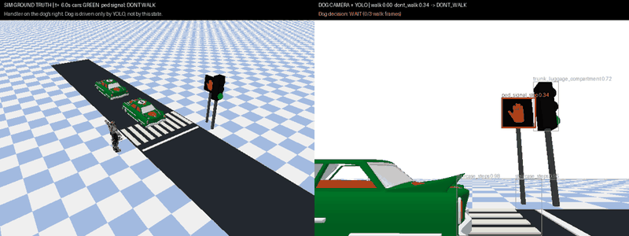

# Guide-dog crossing gated by the blind-escort YOLO model



The dog waits at the curb with its handler on its right (guide dogs work on the
handler's left). A pedestrian signal head across the street shows DON'T WALK
(orange hand) or WALK (white walking person). Every 0.2 simulated seconds the
dog's camera frame goes through `blind_escort_yolo` (the 20-class ONNX model), and
the dog starts crossing only when the **model** reports WALK on 3 consecutive
frames. It then leads the handler to the far curb through the unchanged firmware
bridge. The simulator's signal state is used only to grade the model and the
crossing; it never drives the dog.

## Run

Set up the traffic scene first ([RUN_TRAFFIC.md](RUN_TRAFFIC.md)), then add the model runtime:

```sh
uv pip install --python .venv/bin/python --only-binary=:all: onnxruntime==1.30.0 opencv-python-headless==4.11.0.86
.venv/bin/python simulator/escort_demo.py                       # normal light cycle, writes escort.gif
.venv/bin/python simulator/escort_demo.py --signal stop \
  --output simulator/artifacts/escort-stop                       # negative test: must never cross
.venv/bin/python -m unittest simulator.test_escort_controller
```

Options: `--gui`, `--seconds` (5–90, default 30), `--port` (default 0), `--model`,
`--walk-conf` (default 0.4), `--signal cycle|stop`. Headless runs write
`first.png`, `last.png`, `escort.gif` (left: overhead ground truth, right: dog
camera with model boxes and decision) and `report.json` to `simulator/artifacts/escort`.

## Decision rule

A frame votes **walk** when `ped_signal_walk` ≥ `--walk-conf`, it beats
`ped_signal_stop` by 0.1, and `conflict_vehicle_cyclist` is below 0.5. Any
DON'T WALK or vehicle-conflict detection votes **dont_walk**. Three consecutive
walk votes commit the dog to cross; any other vote resets the count. Once in the
road the dog keeps going to the far curb, because stopping mid-street when the
signal changes to its clearance DON'T WALK is the unsafe choice.

Timing: 22 s red (WALK for the first 10 s once the crossing is clear, then DON'T
WALK clearance), 8 s green, 2 s amber. The run starts at green so the dog first
has to wait. Crossing 5.8 m takes about 9.7 s at the proxy's full stride.

## Checks (`report.json`)

Cycle run: no walk votes on DON'T WALK frames; crossing started while the true
signal was WALK; dog and handler were in the road only while cars were held on
red; both reached the far curb; the handler stayed within 0.8 m of the dog.
Stuck-DON'T-WALK run: no walk votes and the dog never left the curb.

Recorded in [verification-escort.json](verification-escort.json): both runs passed.
While waiting, the model scored 0.00 WALK on every DON'T WALK frame
(51 + 150 frames), confirmed WALK 0.6 s after it appeared, and the closest car
center while the pair was in the road was 2.4 m (cars stopped at the line).

## Limits: read before trusting this outdoors

- The signal face is synthetic and **0.8 m wide** (real heads are about 0.45 m) because
  the model could not reliably read a real-size head from this 0.8 m-high, 65° camera.
- On this synthetic face the model's WALK confidence peaks around **0.47**, so
  `--walk-conf 0.4` was chosen from this scene. Recalibrate it on real footage
  of your crosswalk before relying on it.
- Frames come from PyBullet's TinyRenderer, not a real camera; motion is the
  same planar proxy as `vision_demo.py`, not MechDog walking; the handler is a static mesh.
- The model's earlier DON'T WALK confusion came from red **car** lamps facing the
  crosswalk. This scene turns them toward traffic, as on a real street.
- This demonstrates the control loop and the model's behavior on one simulated
  intersection. It is not evidence of real-street accuracy or safety.
